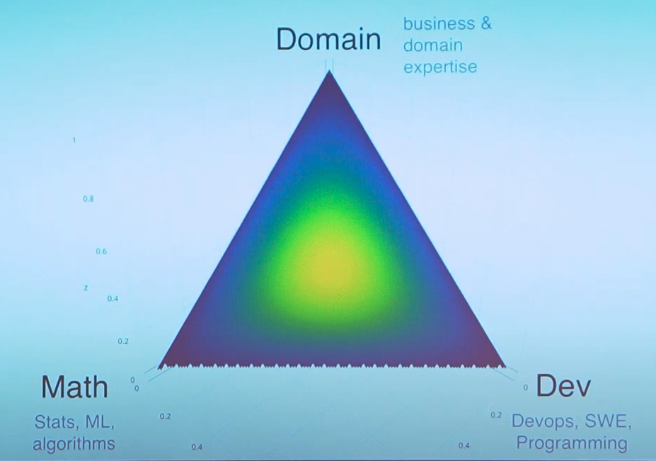

# Mündəricat:

1. [Data Science - kimlərdəndi, nə iş görür](./RoadMap.md#data-science---kimlərdəndi-nə-iş-görür)
	1. [Səthi baxış](./RoadMap.md#səthi-baxış)
	2. [Data Science dünyasının üç qütbü](./RoadMap.md#data-science-dünyasının-üç-qütbü)
	3. [Data Science alt-sahələri](./RoadMap.md#data-science-alt-sahələri)
2. [Yol Xəritəsi](./RoadMap.md#yol-xəritəsi)
	1. [1. Başlanğıc](./RoadMap.md#1-başlanğıc)
		1. [Python](RoadMap.md#python)
		2. [Statistika](RoadMap.md#statistika)
		3. [SQL](RoadMap.md#sql)
		4. [PowerBI](RoadMap.md#powerbi)
		5. [ML](RoadMap.md#ml)
	2. [Daha irəli](./RoadMap.md#2-daha-irəli)
       1. [Python - pythonista səviyyəsi](RoadMap.md#python---pythonista-səviyyəsi)

# Data Science - kimlərdəndi, nə iş görür...

Düşünürəm ki, ilk öncə Data Science nədir sualını ortaya atıb, cavab verməyə çalışmalıyam. Çünki, irəlidlədikcə suallar ortaya çıxacaq - "görəsən bir data science-çı" (qısaca DSçı - de-esçı, özümdən Amerika kəşf edirəm) bunu bilmək nə üçün lazımdır, bəlkə müəllif(məni deyirlər) sadəcə "cool" görünmək üçün adı tanış gələn hər şeyi yazıb... Odur ki, gəlin bünövrəni təyin edək.

#### Səthi baxış
Deməli, bir zamanlar "Kompüter Elmləri mühəndisi" adlı mütəxəssis var idi. O zamanlar, elə zamanlar idi ki, onda kompüter əlaqəli texnologiyalar bu günküi kimi inkişaf etməmişdi, sahə müəyyən qədər dar idi, ona görə də özünə "kompüter elmləri mühəndisi" deyən və kompüterlə bağlı sistem və aparat təminatı ilə məşğul olan adamlar vardı. Bəs bu gün, "kompüter elmləri mühəndisi" deyilən bir peşə var? - Xeyir, yoxdur!

Niyə - çünki, bu sahə o qədər genişlənib və alt-sahələrə bölünüb ki, artıq bir nəfərin bütün bunları öyrənib başa çatdırması mümkün deyil. Məsələn, bu gün backend, frontend, kiber-təhlükəsizlik, software engineer, devops və sair kompüter elmlərinə daxil sahələr var. Niyə belə olur - istənilən istiqamət yeni kəşf edildikdə, o istiqamətdə araşdırmalar, kəşflər baş verir, yəni istiqamət genişlənir və yeni məqamlar ortaya çıxır. "Data Science" - verilənlər haqqında elm kimi tərcümə etmək olar. "Kompüter elmləri"nin mərkəzində kompüter dayanırdısa, burda hər şey "Data" - verilənlər ətrafında baş verir. Gördüyünüz kimi, Data Science(qısaca - DS) də kompüter elmlərinin alt sahəsidir, çünki Data - rəqəmsal datadır və kompütersiz bunu yaratmaq, təmasda olmaq mümkün deyil :). Data həm strukturlu - cədvəl formasında məsələn və ya tam struktursuz ola bilər - şəkil, səs, hansısa sensorların göstəriciləri və sairə. Yəni, dövlət portalındakı şəxsi işimiz və Südabə xalanın marketindəki kameranın çəkdiyi video - hamısı datadır. Özü-özlüyündə data çox faydalı bir şeydir! Datanın əsasında ölkələr idarə olunur, bizə bəzən heç lazım olmayan məhsullar satılır, Votsapda Əliyə yazdığımız ismarıclar Vəliyə getmir və sairə. Data - bir məlumatdır və bu məlumatdan düzgün istifadə etdikdə yaxşıca faydalanmaq olar.

**Bir balaca tarix:**

Data Haqqında Elm nə ilə məşğul ola bilər - Data ilə bağlı proseslərlə. Yaxşı, hansı proseslər ola bilər? Hər şey biznes nöqtəsindən başlayır, təsəvvür edin ki bir möhtəşəm veb sayt ideyamız var - "sayt hazırlayacam, hansı ki xəritədə seçdiyimiz istənilən ev(Bakı şəhəri üçün) üçün təqribi qiymət göstərəcək. Ona görə də kimsə ev almaq, ya da satmaq istədikdə, sayta baxıb təqribi qiyməti biləcək və daha heç kim maklerlərə aldanmayacaq"(maklerlər inciməsin). Görək bu məsələni həll etmək üçün bizə nə lazım ola bilər:
##### Data Toplanması
İlk öncə, datanı toplamaq lazımdır. Bakıdakı istənilən ev barədə qiymət təyin edə bilmək üçün, şəhərdəki evlərin qiymətləri tanış olmaq lazımdır. Bunun üçün isə, evlər və onların qiymətləri barədə data lazımdır. Bunun üçün müxtəlif daşınmaz əmlak elan saytlarını pars edə bilərik. Saytı pars etmək - saytdakı məlumatları proqramla avtomatik olaraq yığıb, özümüzdə saxlamaqdır. Deməli top 10 ən çox ziyarət olunan elan saytını pars edib evlər barədə məlumatları ala bilərəm. Ola bilər ki, hər hansısa dövlət qurumu və ya araşdırmaçı saytın artıq belə bir datası var və ordan götürə bilərik. 
Başqa bir ssenari götürək - dövlət yol polisi idarəsi həftənin müəyyən günləri və saatları üçün əsas yollardakı avtomobil sıxlığını təyin etməyə çalışır ki həmin ərəfələrdə artıq orda DYP müfəttişləri olsun və yollarda hərəkəti tənzimləsinlər. Belə plan halda DYPİ üçün data mənbəyi - yol müşahidə kameraları ola bilər. Trendyol, AliExpress, Umico kimi marketpleys platformaları üçün istifadəçinin hansı mala baxması, səbədə əlavə etməsi, rəy yazması - hamısı datadır. Bəzən isə, yazılı və ya şifahi sorğulardan istifadə etmək olar, sörğuların nəticəsi datadır.
##### 1. Datanın saxlanması və təmizlənməsi

Datanı topladıqdan sonra hardasa və necəsə saxlamaq lazımdır. Data tabulyar - cədvəl formalı datadırsa - relyasiyalı verilənlər bazasında(SQL sorğu əsaslı) saxlamaq olar - MS SQL, OracleSQL və s. Yox, struktursuz datadırsa, fayl sistemli bir yerdə saxlamaq olar, məsələn datalake-də. Hələki, sadəcə bildiyimiz qovluqlar və fayllardan ibarət bir yer kimi təsəvvür edin. Daha bir məqam isə, datanın saxlanılmadan öncə təmizlənməsi ola bilər. Məsələn, data tabulyardır və telefon nömrələri qeyd edilən sütun var - baxıb gördünüz ki heç də bütün nömrələr standart formada yazılmayıb, bəzilərində ölkə kodu var, bəzilərində yoxdur, bəziləri "-" istifadə edir, bəziləri isə yox. Data struktursuzdursa, datanın adını label - ad, işarə kimi adlandıra bilərsiz. Məsələn, ev elanları saytından evlərin şəkillərini də yükləmisiniz və şəkilləri "necə gəldi" saxlamaq olmaz, çünki sonra hansı şəklin, hansı elana aid olduğunu anlamaq lazımdır. Hər elandan 3 ədəd şəkil varsa, şəklin adını label kimi istifadə üçün `<elanın linki>_1`, `<elanın linki>_2` və s. kimi fəndlərdən istifadə etmək olar. Daha bir üsul isə bu cür dataları qovluqlara görə bölüşdürməkdir: `<elan linki>/pic.jpg`. Eyni datanın müxtəlif zamanlardakı versiyaları üçün də belə bir fənd keçərlidir. Deyək ki, mağazada malların qiymətləri və xüsusiyyətləri hər gün yenilənir, onda ən sadə şıxış yolu kimi belə etmək olardı: `2024/11/03/prices.xlsx`
##### 2. Datanın təhlili - analizi
Datanı toplayıb təmizlədikdən sonra ondan yararlanmaq olar. Qayıdaq ev elanları məsələsinə - topladığımız data içərisində evlərə baxarkən, evlərin qiymətlərinə təsir edəcək bir çox məqamlar görə bilərik - şəhərin hansı hissəsində yerləşməsi, metrota qədər məsafə, otaq sayı, təmirin vəziyyəti və sairə. Məsələnin mahiyyətinə yaxından baxsaq, makler roluna girsək, həmçinin görə bilərik ki müəyyən tədbirlər zamanı şəhərin mərkəzi hissələrində kirayə mənzillərin qiyməti 3 dəfəyə qədər arta bilir. 

**Dəşbord və qrafiklər**. Tək "çiy" dataya baxaraq nəsə bir məqam, anlam (ingilis dilindən insight) çıxartmaq olduqca çətindir. Ümumiyyətlə, bizim ən aktiv məlumat qəbuledicimiz - gözlərimizdir, necə deyərlər - yüz eşitməkdənsə, bir görmək yaxşıdır. Odur ki Datanı vizual formaya çevirdikdə bəzən ilkin formada nəzərə çarpmayan məqamları görmək olar. Üstəlik, real iş mühitində biz tək deyilik, əksər hallarda təhlilin nəticəsini məsələnin həllində maraqlı olan insanlara göstərmək lazımdır. Bunun üçün isə Data əsasında elə bir vizual qrafik qurulmalıdır ki, bizim - texniki bacarıqları olan mütəxəssisin tutduğu məqamı həmin adamlar(çox zaman qeyri-texniki) da tutsun. 
##### 3. Datanın tətbiqi
Data ilə bu qədər işləməyimizin məqsədi - sonda datanı gəlirə çevirməkdir, necə ki neft sonda yanacağa çevrilərək hansısa mühərliyin işləməsini təmin edir. Yenidən qayıdaq bizim ev-elanları platformamıza. Data üzərində bu qədər işləməyimizin məqsədi - həmin data içərisindən tapdığımız qanunauyğunluqlara əsaslanaraq evlərin qiymətlərini təxmin edən alət hazırlamaq idi. Yəni, sonda Datanın - hazır məhsula dönüşmə prosesi var. Platfomamız - özü-özlüyündə bir saytdır, saytı hazırlamaq veb tərtibatçıların işidir. Ancaq platformanın mərkəzində bir `X` mexanizmi dayanır, bu mexanizm xəritədəki hər hansı nöqtəni(evin koordinatlarını) alır və geriyə bir rəqəm - təxmin olunan qiymət qaytarır. Baxın, bu `X` bizim əməyimizin nəticəsidir. Son olaraq, `X` mexanizmi necə hazırlandı, harda və necə yerləşdirildi, sayt ilə necə əlaqə saxlayır - bütün bunlar həmçinin Data Science daxilində baş verən şeylərdir.
#### Data Science dünyasının üç qütbü

Ümumilikdə Data Science 3 böyük qütbün kəsişməsində yerləşir:

- **Domain** - data science alətlərini tətbiq edəcəyimiz sahəyə dair biliklər. Əgər bankda işləyiriksə, bu zaman domen bilikləri - bank bilikləri olacaq: risklər necə hesablanır, churn və sair. Əgər hər hansı satış platformasında çalışırıqsa - platformanın iş prinsipi - müxtəlif kompaniyalar, çatdırma, geri-qaytarmaların iş prinsipi və sairə domen biliklər ola bilər. 
- **Math** - riyaziyyat! Riyaziyyatsız nəinki Data Science, ümumiyyətlə heç sadə hesablayıcı - kalkulyator da olmazdı. Bütün modellər, fərziyyələr - hamısı riyaziyyat üzərində dayanır. Amma, sual yaransa - "DSçi riyaziyyatçı olmalıdır?", cavab - "xeyr" olar, ya da ki "demək olar ki xeyir". Çünki, riyaziyyat yeni alətlər yaratmaq və yaxud onların parametrləri ilə daha savadlı şəkildə "oynamaq" üçün lazım ola bilər. Yəni, DSçilər üçün bu kritik tələb olmaya bilər.
- **Dev** - development, yəni proqramlaşdırma və bununla bağlı texniki əməliyyatlar. Baxsaq, görərik ki, hər hansı modelin nüvəsində riyaziyyat dayanır, bu okay. Ancaq, nüvə hər hansı proqramlaşdırma dili ilə yazılmış kitabxananın içərisindədir. Məsələn, pythonda `sklearn`, `pytorch`, `tensor-flow` və sairə - bunların hamısı proqram paketləridir və onlarla işləmək üçün "kod yazmaq" lazımdır. Digər tərəfdən isə *deployment* məsələsi var. *Deployment* - bir növ "yerləşdirmə" kimi tərcümə oluna bilər. Deyək ki, hər hansı model hazırlamışıq, model - evin qiymətini təxmin edir. Son olaraq, modelin təyinatı domen sahibkara - biznesə hər hansı xeyir verməkdir və model harasa yerləşdirilməlidir, modelə hardansa təxmin edilməli evlərin siyahısı gəlməlidir, model təxmin etdiyi qiyməti harasa və necəsə ötürməlidir. Məhz bu "harasa-necəsələri" deployment edən DSçi həll edir.

##### Data Science alt-sahələri
Gördüyünüz kimi, təkcə səthi baxışda DSçinin üzərinə nə qədər məsuliyyət düşdü! İlk başlayanda DS sahəsini Kompüter elmləri ilə müqayisə etdim və dedim ki hal-hazırda kompüter elmlərində onlarla alt-sahələr var və hər sahənin mütəxəssisinin də öz adı var. DS-də də eynilə. Çat GPT-dən mənə Data Science alt sahələrini və onların təyinatlarını çap etməsini istədim, [nəticə](src/ds%20professions.md). Ancaq, onu da başa düşmək lazımdır ki, bu sahələrin əksəriyyəti bir-biri ilə çox oxşardırlar və bir adamın bu sahələrin bir neçəsi ilə məşğul ola bilməsi adi haldır. Ancaq heç də bütün alt-sahələr bir-biri ilə bu qədər yaxın deyillər. Bütün bu sahələr yuxarıda baxdığımız DS üçbucağının içərisində yerləşir: bəziləri riyaziyyat və developmentə yaxın domendən uzaqdır, bəziləri isə əksinə. Yəni, hər bir sahə, bu üç tərəfin arasında bir yer alır. Gəlin, alt-sahələrin bəzilərinə göz ataq:
- Data Analitik(DA) - dataya əsaslanaraq müəyyən məqamları, qanunauyğunluqları tapan və onları göstərən adamlardır. Data ilə işlədikləri üçün SQL, Excel bəzən isə Python lazım ola bilər. Python dedikdə daha çox əsas - baza səviyyəsi və pandas nəzərdə tutulur - mənbədən lazım olan hissəni rahatlıqla almaq üçün bəs edəcək səviyyədə. Ancaq, datadan "insight" çıxartmaq bir yana, bunu digərlərə - biznesə necə göstərmək, sübut etmək olar? Axı onlar əksərən texniki cəhətdən o qədər də bilikli olmurlar, böyük cədvəllər, sql-python kodlar, uzun mətnlər onlarçün qaranlıq və yorucu bir şey kimi gəlir. Ona görədə çatdırmaq istədiyimiz məqamlar olduqca *reprezentativ* - özü-özünü rahatlıqla təqdim edən, anlada bilən olmalıdır. Əsas məğzi çatdıracaq vizual qrafiklər, ədədi göstəricilər, başlıq yazılar və sairə. Bunun üçünsə, əksərən BI alətlərdən istifadə olunur - PowerBI, Tableu. Burda onu nəzərə almaq lazımdır ki, əsas məqam - dataya əsasən düzgün tərzdə düşünüb, datanın domeninə xas xüsusiyyətlərini düzgün anlamaqdır. Yəni. əgər data bank sektoruna aiddirsə, analitik bank sektoruna aid biznes biliklərə sahib olmalıdır, bu ona "daha savadlı" fərziyyələr irəli sürməyə imkan verəcək. Beləliklə, analitik daha çox domen hissəyə yaxındır, nəinki texniki hissəyə. 
- ML Engineer(MLE) - əsasən, ML modellərin tran/test edilməsi, optimallaşdırılması ilə məşğul olurlar. Əsas diqqət ML model, bu model üçün əlamətlərin(feature) tərtib edilməsi dayanır. Burada ML bilikləri əsas yer tutur, ML modellərinin düzgün tənzimlənməsi üçün isə, onların parametrləri, xüsusiyyətləri barədə məlumatlı olmaq lazımdır. Bəli, bu məqamda "riyaziyyat olmasa da olar" demək alınmayacaq, çünki məhz riyaziyyat lazım olacaq. Sıfırdan öz modelinizi yazmasaz da, mövcud sadəcə `from sklearn ... import ...` kimi bir-neçə sətr kod yazmaqla iş bitməyəcək. Beləliklə lazım olan biliklər ML, ml alətləri ilə rahat işləyə bilmək üçün texniki biliklər, əlamətləri daha tez və məntiqlə seçmək üçün müəyyən qədər domen bilikləri(analitik qədər olmasa da) lazım olacaq.
- MLOps Engineer - ML modellərini, onların çalışacaqları mühitə yerləşdirən, deploy edən adamlardırlar. Bir növ DevOps Engineer-lər kimi, ancaq daha çox ML yönümlü. Bəlli məsələdir ki, DS-çinin(və yaxud MLE) modeli hazırladığı `untitled.ipynb` noutbuku production-da işləməyəcək, modeli necəsə, hardasa yerləşdirmək lazımdır. Üstəlik, modelə yeni datanın emal olunub ötürülməsi və sairə - bunlar daha çox texniki məqamlar olduğu üçün, adi MLE və ya Data Analitikin etməli olduğu bir şey deyil, odur ki bu işlərlə Machine Learnin Operations Engineer məşğul olur. MLOps Engineer-lər CI/CD payplaynlarının yazılması, modelin giriş-çıxış yolunnun təmin edilməsi, müəyyən təhlükəsizlik şərtlərinin yoxlanılması və sairə ilə məşğul olur.
- Data Engineer - MLOps Engineer kimi daha çox texniki sahədir, ancaq burada daha çox data üzəri əməliyyatlar aparılır - datanın mənbədən toplanması, təmizlənməsi, yoxlanması, datawarehouse-ların qurulması(bu yerdə əslində mübahisə etmək olar) və sairə. Bütün bunlar adətən avtomatlaşdırılmış data payplaynları ilə edilir.
MLOps Engineer və Data Engineer - hər ikisi Software Engineering alt sahələridir. Eyni paradiqmalar, eyni yanaşmalar, sadəcə birincisi daha çox ML modellər, digərisi isə data üzərində fokuslanır. Gördüyünüz kimi, yalnız baxdığımız dörd sahə bir-biri ilə kifayət qədər oxşardır. Bütün bunları Data Scientistin üzərinə atmaq olar, çünki tərifə uyğun gəlir. Ona görə də hal-hazırda Data Scientist - yuxarıdakı tələbləri yaxşı-pis edə biləcək adamdır. Tətbiq sahəsi dəqiqləşdikcə, vəzifə və öhdəliklər, tələb olunan bilik və bacarıqlar da dəqiqləşir. 

# Yol Xəritəsi

> [!note]
> Mənbələr əsasən ingilis dilində olacaq. Səbəb sadədir - Kompüter Elmləri, İT-də hər şey bu dildə yazılır, yaradılır. Hər şey bu dildə yazılmış mənbələrə istinad edir.

## 1. Başlanğıc

Başlanğıc üçün bir az statistika, proqramlaşdırma, SQL və BI lazımdı. Proqramlaşdırma dili kimi - Python, BI qismində - Power BI, SQL üçün isə əsas məsələ ümumi sorğu məntiqini anlamaqdır.
#### Python

| index | ad                                                                                                                    | təsviri                                                                                                                                                                    |
| ----- | --------------------------------------------------------------------------------------------------------------------- | -------------------------------------------------------------------------------------------------------------------------------------------------------------------------- |
| 1     | [Python for Beginners - Learn Coding with Python in 1 Hour](https://www.youtube.com/watch?v=kqtD5dpn9C8)              | Bir saatlıq, əsas anlayışlardan bəhs edir.                                                                                                                                 |
| 2     | [Python Tutorials(hələki ilk 50 video)](https://www.youtube.com/playlist?list=PL-osiE80TeTt2d9bfVyTiXJA-UTHn6WwU)     | Corey Schafer - 1 nömrəli Python dərsləri müəllifidir. Məzmun bir balaca köhnəlsə də, faydasız zərrə qədər məlumat yoxdur. Başlanğıc üçün, ilk 50 video dərsə baxmaq olar. |
| 3     | [Pandas Tutorials - Corey Schafer playlist](https://www.youtube.com/playlist?list=PL-osiE80TeTsWmV9i9c58mdDCSskIFdDS) | Corey Schafer müəllimin Pandas dərsləri                                                                                                                                    |
| 4     | [Sentdex - Matplotlib Tutorial Series](https://www.youtube.com/playlist?list=PLQVvvaa0QuDfefDfXb9Yf0la1fPDKluPF)      | matplotlib öyrənmək üçün ən yaxşılardan biri. Müəllif kifayət qədər təcrübəli və şəndir.                                                                                   |
#### Statistika

| index | ad                                                                                                             | təsviri                                                                                                                                               |
| ----- | -------------------------------------------------------------------------------------------------------------- | ----------------------------------------------------------------------------------------------------------------------------------------------------- |
| 1     | [Descriptive Statistics](https://www.youtube.com/playlist?list=PLTNMv857s9WVStKLco6ZBOsfSGXzJ1L0f)             | Təsviri statistikanın əsaslarını əhatə edir. Kanalda həmçinin hypotesis testing və s. mövzular da var.                                                |
| 2     | [Statistics Course for Data Science](https://www.youtube.com/playlist?list=PLqzoL9-eJTNBZDG8jaNuhap1C9q6VHyVa) | Data Science yönümlü A-Z tipli playlist                                                                                                               |
| 3     | [Khan Academy - Statistics](https://www.youtube.com/playlist?list=PL1328115D3D8A2566)                          | Khan Academy yalnız statistika deyil, ümumiyyətlə riyaziyyatı yavaş-yavaş A-Z anlaşıqlı və intuitiv səviyyədə öyrənmək istəyənlər üçün qızıl mənbədir |
#### SQL

| index | ad                                                                                                                   | təsviri                                                                                      |
| ----- | -------------------------------------------------------------------------------------------------------------------- | -------------------------------------------------------------------------------------------- |
| 1     | [Mediumda Yol Xəritəsi məqaləsi](https://estheranagu.medium.com/clear-roadmap-to-mastering-sql-in-2024-db633eac4c88) | Müəllif SQL mövzularını əsaslardan-dərinə doğru bölüb, tətbiq edə biləcəyiniz saytlar verib. |
| 2     | [Learn SQL in 1 Hour - SQL Basics for Beginners](https://www.youtube.com/watch?v=9Pzj7Aj25lw)                        | Sadə və aydın 1 saatlıq video dərs.                                                          |
| 3     | [SQL Tutorial - Full Database Course for Beginners](https://www.youtube.com/watch?v=HXV3zeQKqGY&t=3698s)             | 4 saatlıq SQL(MySQL)                                                                         |
#### PowerBI

| index | ad                                                                                                           | təsviri                                                                                                                                                   |
| ----- | ------------------------------------------------------------------------------------------------------------ | --------------------------------------------------------------------------------------------------------------------------------------------------------- |
| 1     | [Power BI Tutorials for Beginners](https://www.youtube.com/playlist?list=PLUaB-1hjhk8HqnmK0gQhfmIdCbxwoAoys) | Adından da göründüyü kimi, başlanğıc üçün nəzərdə tutulmuş video kursdur, hərəsi 10-15 dəq çəkən 9 dərsdən ibarətdi                                       |
| 2     | [Power BI Full Course Tutorial](https://www.youtube.com/watch?v=e6QD8lP-m6E)                                 | Daha bir PBI kursu(~8 saat). Qrafik elementlərdən tutmuş, DAX funksiyalara, bəzi xüsusi fəndlərə qədər mövzular barədə danışılır.                         |
| 3     | [Beginner Power BI DAX Functions Tutorial ](https://www.youtube.com/watch?v=QJw4HkagVWc)                     | DAX ifadələrə fokuslanmaq üçün istifadə etmək olar. 3 saata yaxın müddətdə ən çox istifadə olunan DAX funksiyaları və istifadə nümunələri izləyəcəksiniz. |

#### ML
| index | ad                                                                                                                          | təsviri                                                                                                                                                                                                                                                                                                           |
| ----- | --------------------------------------------------------------------------------------------------------------------------- | ----------------------------------------------------------------------------------------------------------------------------------------------------------------------------------------------------------------------------------------------------------------------------------------------------------------- |
| 1     | [Stanford CS229: Machine Learning Course](https://www.youtube.com/playlist?list=PLoROMvodv4rMiGQp3WXShtMGgzqpfVfbU)         | Mühazirəni oxuyan - Andrew müəllim, deyərdim ki ML tanınmasında ən çox əməyi olan adamdır. Başlanğıc üçün, bu pleylistin ilk 10 videosunu başa düşməyə çalışa bilərsiniz.                                                                                                                                         |
| 2     | [Krish Naik - Complete Machine Learning playlist](https://www.youtube.com/playlist?list=PLZoTAELRMXVPBTrWtJkn3wWQxZkmTXGwe) | Müəllif ML aləminin demək olar ki bütün sahələrinə aid material hazırlayıb. Alqoritmin arxasında dayanan məntiqi anlamaq üçün yaxşı mənbədir. Pleylistin 29-cu videodərsi və sonrasına baxmaq olar, gerisi python dərsləridir. Ümumilikdə Statistika, ML, tövsiyyə, müsahibə sualları və s aid məqamlara toxunub. |
| 3     | [Machine Learning with Python](https://www.youtube.com/playlist?list=PLQVvvaa0QuDfKTOs3Keq_kaG2P55YRn5v)                    | Müəllif ML alqoritmlərini kod içərisində tətbiqi şəkildə göstərir. Hər şey sentdex tərzində )                                                                                                                                                                                                                     |

## 2. Daha irəli...

#### Python - pythonista səviyyəsi

> [!note]
> Təxmin edirəm ki, bu ana qədər Pythonda rahatlıqla sadə verilənlər tiplərindən(ədədlər, sətrlər, siyahılar, lüğətlər və s.), dövrlərdən, funksiyalardan(öz funksiyalarınızı yarada, `print` və `return` arasında fərqi bilirsiniz) istifadə edə bilirsiniz. Bundan başqa, mütəmadi ifadələr(regex - `re` modulu), sadə veb parsinq(`beautifulsoup` ilə), DS kitabxanaları(pandas, matplotlib və numpy əsasları) ilə də tanlşsınız. Bundan sonra, əsas fokus - yazdığınız kodun keyfiyyətini artırılmasına, əlavə alətlərin öyrənilməsinə(həm standart kitabxanadan, həm də üçüncü tərəf kitabxanalardan) yönələcək. Keyfiyyət dedikdə - kodun optimal və anlaşılan olması nəzərdə tutulur.

##### OOP
İlk olaraq öncə adını çəkdiyim bu "[Python Tutorials](https://www.youtube.com/playlist?list=PL-osiE80TeTt2d9bfVyTiXJA-UTHn6WwU)" pleylistdən baxmaq olar - müəllif obyekt yönümlü yanaşmanı əsas paradiqmaları ilə həm nəzəri, həm də tətbiqi şəkildə izah edir.  Ümumiyyətlə, bu pleylisti tam bitirməyi məsləhət görərdim(flask və django hissələrini buraxmaq olar, əvəzinə Fast API daxil etmək şərti ilə, bunun üçün sonda mənbələr verəcəm. Görəcəksiniz ki, dərslər arasında logging, testing, kodda məxvi məlumatlardan istifadə etmə və s. yer alır, bunların hamısı bizə lazım olacaq). Müəllifin OOP üçün ayrıca [playlisti](https://www.youtube.com/playlist?list=PL-osiE80TeTsqhIuOqKhwlXsIBIdSeYtc).  Daha sonra(və ya əvvəl - fərqi yoxdur) [Python Object Oriented Programming Full Course 🐍](https://www.youtube.com/watch?v=IbMDCwVm63M) 2 saatlıq dərsdə daha çox nəzəri də olsa, Pyhtonda OOP ilə daha dərindən tanış ola bilərsiniz. 
##### Web App
Data Science-də veb app yaratmaq tələbatı nadir bir şey deyil. Çox vaxt, modeli ən azından test üçün hansısa bir yolla veb app içərisinə "büküb" test üçün komanda yoldaşlarına və ya testerlərə vermək lazım gəlir(və ya koddan anlayışı olmayan biznesə nümayiş etdirmək üçün). Pythonda veb app yaratmaq üçün xeyli freymvörk(framework) var: Django, Flask, Fast API, StreamLit və digər az tanınanlar. Django daha çox veb development üçün uyğundur, içərisində əvvəlcədən hazırlanmış N qədər məntiq var. Biz - DSçilər üçün isə, sadəcə modeli içərisinə "atıb", bir az vizual verəcəyimiz bir şey lazımdır. Bunun üçün Flask və yaxud FastAPI seçilə bilər. FastAPI daha yenidir və müasir Python yanaşmaları ilə ayaqlaşır. Əlavə olaraq sırf DS məsələləri üçün Streamlit öyrənmək olar, bu freymvörk daha sadədir, sizdən frontend(html, css və s) tələb etmir. FastAPI üçün [FastAPI Tutorial - Building RESTful APIs with Python](https://www.youtube.com/@amigoscode) saatlıq video kursu məsləhət görərdim. Daha sonra, nəsə **əjdaha** bir şey axtarsaz [Python API Development - Comprehensive Course for Beginners](https://www.youtube.com/watch?v=0sOvCWFmrtA&t=2057s) baxa bilərsiniz. 

Streamlit üçün [Build A Beautiful Machine Learning Web App With Streamlit And Scikit-learn](https://www.youtube.com/@patloeber) ilə başlamaq olar. Daha sonra, [rəsmi səhifələrindən](https://docs.streamlit.io/) digər komponentlərlə tanış ola bilərsiniz. 
##### Bəzi kitabxana və alətlər
- [Type Hinting](https://docs.python.org/3/library/typing.html) - Pythonda dəyişənlərin və parametrlərin tiplərini işarələməyə imkan verir. [Tech With Tim](https://www.youtube.com/watch?v=QORvB-_mbZ0) və [bu](https://www.youtube.com/watch?v=dgBCEB2jVU0).
- [Dataclass-lar](https://docs.python.org/3/library/dataclasses.html) - Python 3.7-də təşrif buyuran və özlərindən konkret strukturlu datanı saxlamaq üçün istifadə olunan classlardır(daha doğrusu class-dekoratoru). [ArjanCodes](https://www.youtube.com/watch?v=CvQ7e6yUtnw&t=763s),[MCoding](https://www.youtube.com/watch?v=vBH6GRJ1REM) 
- [Pydantic](https://docs.pydantic.dev/latest/) - Pythonda data validasiyası üçün əla bir kitabxana. [ArjanCodes](https://www.youtube.com/watch?v=502XOB0u8OY&t=46s) və [sonra](https://www.youtube.com/watch?v=zN4VCb0LbQI&t=10s)
- [Unittest](https://docs.python.org/3/library/unittest.html) - Corey müəllimin [videosu](https://www.youtube.com/watch?v=6tNS--WetLI&t=1446s), hələ də baxmamısınızsa.
- [Pathlib](https://docs.python.org/3/library/pathlib.html) - Fayl sistemində path-lərlə işləmək üçün standart kitabxana. [Corey](https://www.youtube.com/watch?v=yxa-DJuuTBI&t=13s), [Arjan](https://www.youtube.com/watch?v=UcKkmwaRbsQ&t=140s).
- [collections](https://docs.python.org/3/library/collections.html) - 

## Faydalı Youtube kanalları

- [Sentdex](https://www.youtube.com/@sentdex) - Deep Learnin, ML mövzularında əla pleylistləri var, pozitiv və sərbəst çatdırır. Camaat GTA V oynayanda(mən o zamanlar hələ GTA SA oynayırdım), adam GTA V-də avtonom maşın hazırlayırdı :) 
- [ArjanCodes](https://www.youtube.com/@ArjanCodes) - Python ilə müasir və təmiz proqramlaşdırmanı öyrənmək üçün əla kanal. 
- [MCoding](https://www.youtube.com/@mCoding) - müəllif haqqında danışdığı mövzuların dərinliyinə dalır. Bəzən təkrarən bir-neçə dəfə baxmalı olursan :)
- [Krish Naik](https://www.youtube.com/@krishnaik06) - Müəllifin AI ilə bağlı yüzlərlə videoları var, sadə, əlüstü təqdimatı var. 
- [3Blue1Brown](https://www.youtube.com/@3blue1brown)- qəliz riyaziyyatı görərək başa düşmək üçün möhtəşəm kanal. Animasiyalar başqa səviyyədir. ML, DL arxasındakı riyaziyyatı bilmək istəyənlər üçün faydalı olacaq.
- [From Languages to Information](https://www.youtube.com/@fromlanguagestoinformation4012) - NLP(Natural Language Processing) ilə maraqlananlar üçün. Adamın eyni adlı kitabı da var. 
- [Victor Lavrenko](https://www.youtube.com/@vlavrenko) - Neyron Şəbəkələr və IR üçün.